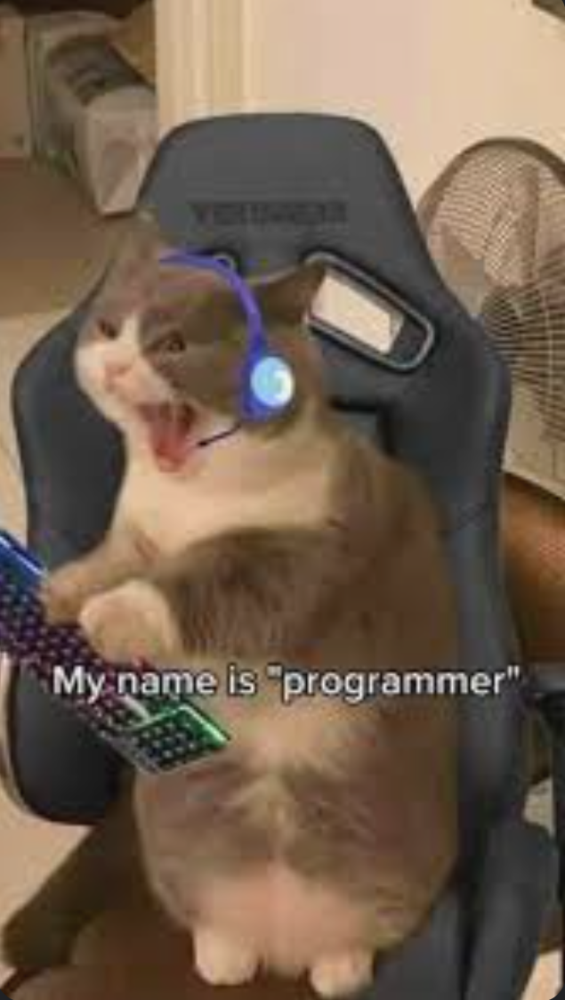

# О себе
Меня зовут Ваня, мне 24 года, я обучаюсь в Нетологии на курсе Python-разработчик. Прошлой зимой я окончил Санкт-петербургский Горный университет, специальность Горный инженер. На курс пришел, потому что хочу получить более современную профессию. 

